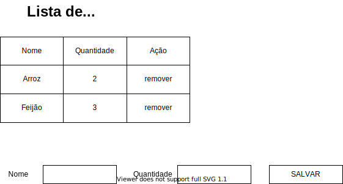

# Avaliação: Implementação de uma lista de compras

## Frontend

O frontend desenvolvido utilizando React deve possuir as sequintes funcionalidades:

- Deve exibir uma listagem com todos os itens da lista de compras.
- Deve permitir adicionar itens a lista informando nome e quantidade de cada item.
- Deve permitir remover itens da lista de compras.

## Backend

O backend deve possuir rotas/endpoits para:
- adicionar itens na lista
- remover itens da lista

## Será avaliado o funcionamento e o uso dos seguintes itens:
JAVASCRIPT/TYPESCRIPT
- Bom uso de tipagem
- Arrow functions
- Async await
- Destructors
REACT
- High Order Component
- Stateless Componen
- Pattern de composição

### Link download
https://github.com/vitorblz/node-react-test/archive/refs/heads/master.zip